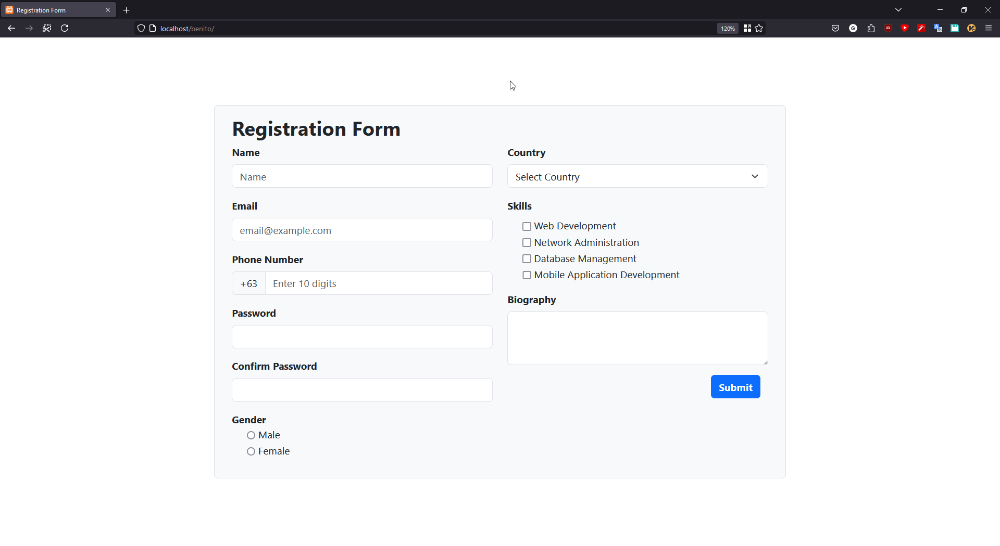
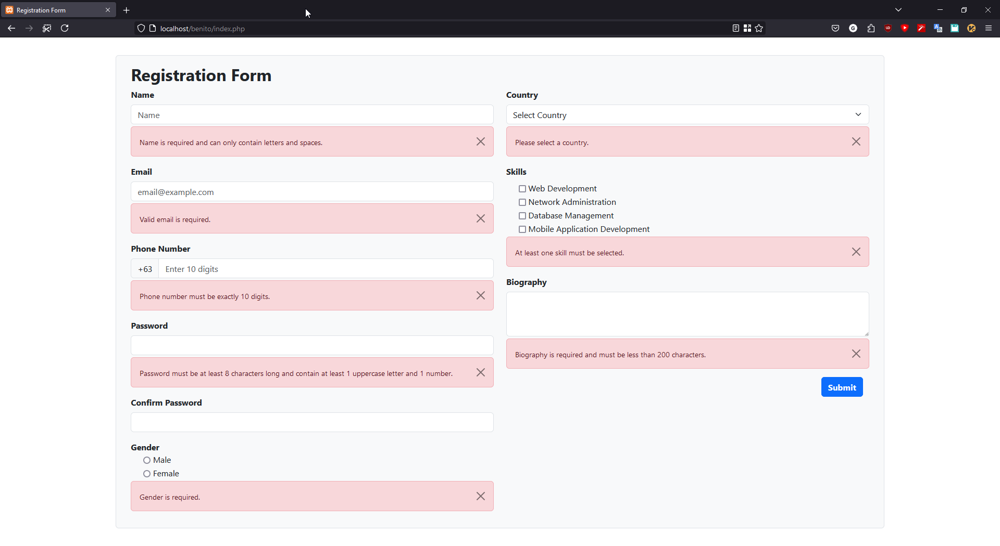
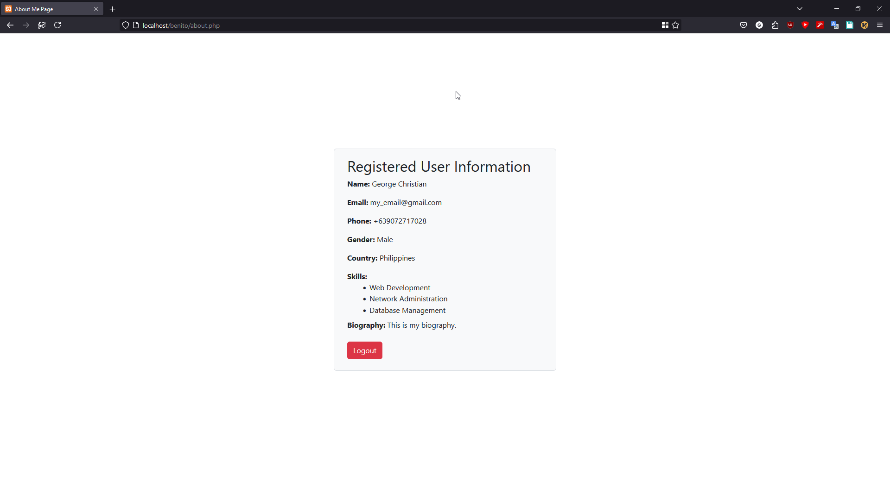

## Name: Benito, George Christian V.
### BSIT 3E
#### Date: September 25, 2024 / Deadline: September 30, 2024

# FORM VALIDATION AND SANITATION (SERVER SIDE)

### **Objective:**
> * Create a registration form with a variety of input fields 
> * Use PHP to validate and sanitize user input with appropriate functions.  
> * Display error messages for incorrect inputs and process data only if all inputs are valid.

### **Instructions:**

> #### **1. Create a registration form with the following fields:**
 >>- [x] Name(Text)
 >>- [x] Email(Text)
 >>- [x] Phone number(Digits)
 >>- [x] Password(Password)
 >>- [x] Confirm Password(Password)
 >>- [x] Gender (Radio buttons)
 >>- [x] Country (Dropdown)
 >>- [x] Skills (Checkboxes)
>>- [x] Biography (Textarea)
>#### **2. Validate and Sanitize user Inputs**
>- [x] Done
>#### **3. Validation for each field is as follows (STRICTLY NO USING OF REQUIRED ATTR):**
>>- [x] Name: Required, only letters and spaces allowed.
>>- [x] Email: Required, must be valid email format.
>>- [x] Phone number: Required, Philippine format (eg.. +639012345678).
>>- [x] Password: Required, must be at least 8 characters, combination of alphanumeric characters, must have at least 1 uppercase letter.
>>- [x] Confirm Password: Must match password.
>>- [x] Gender: Required.
>>- [x] Country: Required, must be selected from the dropdown.
>>- [x] Skills: Required, at least one checkbox must be checked.
>>- [x] Biography: Required, max length of 200 characters.
>#### **4. Display an error message for each validation of the input fields.**
>- [x] Done
>#### **5. Once successful, store the values to the session. Redirect the user to ```about.php``` where you will be displaying his/her details.**
>- [x] Done
>#### **6. Use bootstrap 5 for your design.**
> - [x] Done
>
>#### **7. Upload your output in GitHub and invite me as a collaborator (adoramarkdenver@gmail.com)**
>- [x] Done

# OUTPUT
><details>
><summary>Registration Form</summary> 
>
>
>
></details>
>
><details>
><summary>Registration Form Notification</summary> 
>
>
>
></details>
><details>
><summary>About Me Page</summary> 
>
>
>
></details>
 
